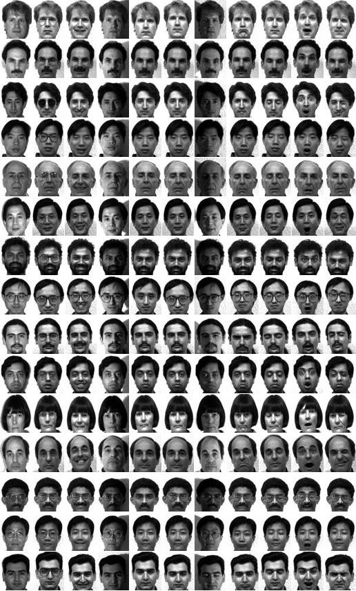

## Example of inputs

Tensor-SVD Face Recognition on the YALE Dataset

## Description

This project implements a tensor-based face recognition system on the YALE dataset using a multilinear SVD (HOSVD-style) decomposition. Training images are resized to 100×100, stacked into a 3D tensor (pixels × expression × subject), and decomposed via mode-wise unfolding and economy SVD. Test images are projected into the learned low-rank subspace, and identity is predicted by nearest-neighbour matching in the subject-factor space. The code is written in MATLAB and includes custom tensor unfolding and mode-n product routines.